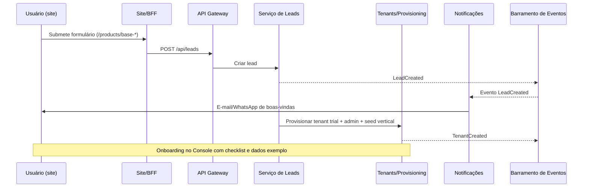
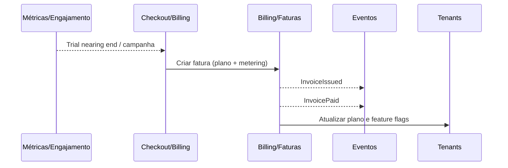
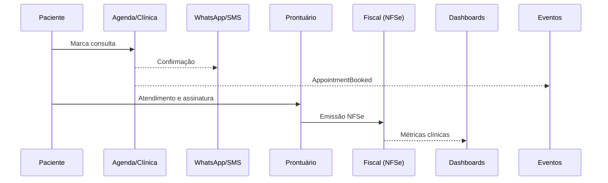
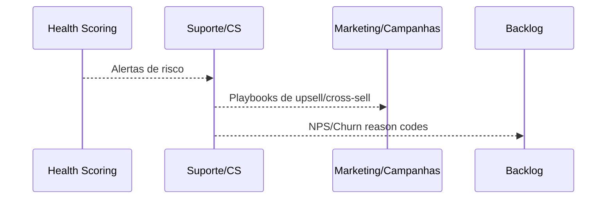

# Arquitetura e Arquitetura Orientada a Fluxo (Flow-Oriented) — Ecossistema SaaS Base®

## 1) Objetivo
Alinhar uma arquitetura de produto e plataforma SaaS multi-tenant para o Grupo Base®, cobrindo visão sistêmica, decomposição por domínio/vertical, camadas técnicas, integrações, segurança, governança de dados, DevOps e uma Arquitetura Orientada a Fluxo que explicita como o valor flui do marketing à operação diária.

## 2) Visão de produto e escopo funcional
- **Portfólio de soluções**: módulos verticais prontos (Clínicas, Hospital, Comércio, Serviços, Agro, Food, Salões, Barbearia, Pet, Shop, Indústria, Construtora/Inc., POS e Tecn), com narrativas e cartões de diferenciais.
- **Rotas e navegação**: site `/(home)` e `/products/base-*` com âncoras `#recursos`, `#depoimentos`, `#contato`. Rotas de API de leads (`/api/lead(s)`) e admin (`/admin/webhook-config`).

## 3) Arquitetura de referência (macro)
- **Estilo**: SaaS multi-tenant; módulos por domínio; API-first; event-driven; 12-factor; config-as-code.
- **Camadas**:
  - Experiências: site público, console multi-tenant, portais (checkout, PDV, KDS, autoatendimento).
  - Canais e Integração: API Gateway, BFFs por experiência, webhooks, filas/streaming.
  - Serviços de Domínio: Core (identidade, RBAC, tenants, billing, catálogo, fiscal, notificações, documentos) e Verticais.
  - Dados e Analytics: bancos por domínio com particionamento por tenant, DW e relatórios por vertical.
  - Plataforma: observabilidade, feature flags, secrets, CI/CD, IaC, segurança, backup e DR.
- **Decisões-chave**: multi-tenancy híbrido (RLS + schema-per-tenant onde preciso), pacotes de capabilities por vertical, BFF por experiência, eventos de negócio versionados.

### Diagrama de Containers (C4)
```mermaid
C4Container
    title Base® — Visão de Containers
    Person(user, "Cliente/Operador")
    System_Boundary(base, "Plataforma Base®") {
      Container(web, "Site Público", "Next.js", "Landing e captação de leads")
      Container(app, "Console Multi-tenant", "Next.js App Router", "Operação por vertical com RBAC")
      Container(pdv, "PDV/KDS/Portais", "Web/Embedded", "Canais operacionais")
      Container_Boundary(apis, "Canais e Integração"){
        Container(gw, "API Gateway", "Edge/Ingress", "Routing, rate limit, auth")
        Container(bff_site, "BFF Site", "Node", "Form/lead, conteúdo, SEO")
        Container(bff_app, "BFF Console", "Node", "Agregação por módulo")
      }
      Container_Boundary(svcs, "Serviços de Domínio"){
        Container(coreid, "Identidade & RBAC", "Service", "SSO, OIDC, claims")
        Container(ten, "Tenants & Planos", "Service", "Org, planos, limites")
        Container(bill, "Billing & Faturas", "Service", "Metering, faturas, conciliação")
        Container(cat, "Catálogo", "Service", "Produtos, serviços, listas de preço")
        Container(fiscal, "Fiscal", "Service", "NFe/NFCe/NFSe/CTe/MDFe")
        Container(notif, "Notificações", "Service", "E-mail, SMS, WhatsApp, push")
        Container(doc, "Documentos", "Service", "Uploads, templates, assinatura")
        Container(health, "Vertical: Healthcare", "Service", "Agenda, prontuário, TISS")
        Container(retail, "Vertical: Retail/Shop/POS", "Service", "PDV, estoque, OMS")
        Container(food, "Vertical: Food", "Service", "PDV, comanda, KDS")
        Container(ind, "Vertical: Indústria", "Service", "MRP/PCP, lote, OEE")
        Container(cons, "Vertical: Construção", "Service", "Obra, custos, cronograma")
      }
      Container_Boundary(data, "Dados & Analytics"){
        ContainerDb(pg, "Postgres (multi-tenant)", "RLS + schemas", "OLTP por domínio")
        ContainerDb(dw, "Data Warehouse", "Columnar", "Marts por vertical")
        Container(queue, "Eventos", "Kafka/Redpanda", "LeadCreated, InvoicePaid, ...")
        Container(blob, "Object Storage", "S3-compatible", "Documentos e mídias")
      }
      Container_Boundary(platform, "Plataforma"){
        Container(obs, "Observabilidade", "Logs/Metrics/Trace", "SLOs e alertas")
        Container(sec, "Segurança & Segredos", "Vault/KMS", "MFA, rotação, WAF/CSP")
        Container(ci, "CI/CD & IaC", "Pipelines", "SBOM, SAST/DAST, IaC")
      }
    }
    Rel(user, web, "Visita/Converte")
    Rel(web, bff_site, "Form/Leads, conteúdo")
    Rel(bff_site, gw, "REST/GraphQL")
    Rel(gw, coreid, "Auth/OIDC")
    Rel(gw, ten, "Tenants")
    Rel(gw, bill, "Billing")
    Rel(gw, notif, "Notificações")
    Rel(gw, health, "Domínios verticais")
    Rel(health, fiscal, "Integrações fiscais")
    Rel(svcs, queue, "Publica eventos")
    Rel(app, bff_app, "Operação diária")
    Rel(bff_app, gw, "APIs privadas")
    Rel(svcs, pg, "OLTP")
    Rel(svcs, blob, "Arquivos")
    Rel(svcs, dw, "CDC/ETL -> marts")
```

## 4) Domínios
- **Core**: Identidade/SSO/RBAC; Tenants/Planos; Billing/Faturas; Catálogo; Fiscal; Notificações; Documentos.
- **Verticais**: detalhadas a partir dos cartões de diferenciais (Clínica, Hospital, Comércio, Serviços, Agro, Food, Salões/Barbearia, Pet, Shop, Indústria, Construção, POS/Tecn).

## 5) Frontend, rotas e BFF
- Público: `/`, `/products/base-*` com `#recursos`, `#depoimentos`, `#contato`.
- Privado: Console multi-tenant por módulos e permissões; Admin: `/admin/webhook-config`.
- BFF por experiência: Site, Console, PDV, KDS.

## 6) Dados e Analytics
- Multi-tenant: `tenant_id` com RLS para horizontais; schemas por vertical onde necessário; chaves para entidades core.
- Catálogo de eventos: LeadCreated, CheckoutCompleted, InvoiceIssued, InvoicePaid, AppointmentBooked, SurgeryScheduled, StockDecremented, WorkOrderClosed, ProductionOrderReleased.

## 7) Integrações e Webhooks
- HMAC assinado, reentrega com backoff, idempotência por `event_id`, `spec-version`.
- Receptores em `/api/webhook/*` com verificação e replay seguro.

## 8) Segurança e Conformidade
- SSO + MFA, RLS, criptografia, auditoria exportada a SIEM, backups testados, DLP em saúde, privacy-by-design.

## 9) DevOps, IaC e Observabilidade
- CI/CD com quality gates, SBOM, SAST/DAST, preview envs.
- IaC para gateway, filas, bancos, redes.
- SLOs por experiência.

## 10) Identidade e Autorização
- Modelo: organização → unidades → times → usuários.
- RBAC com perfis base e claims por vertical; ABAC leve; delegated auth via OAuth2 Client Credentials.

## 11) Design System e Paletas
- Tokens de design por vertical; DS Base® com libs por plataforma e documentação.

## 12) Arquitetura Orientada a Fluxo — Sequências chave

### Fluxo A — Lead → Trial


### Fluxo B — Trial → Cliente Pagante


### Fluxo C — Operação Clínica (exemplo)


### Fluxo D — Suporte/Retenção/Expansão


## 13) Blueprint de Implantação
- Front: Next.js 14 + Tailwind; rotas públicas/privadas; BFFs.
- API: Gateway com roteamento para serviços; auth central; rate limiting.
- Mensageria: Kafka/Redpanda, schema registry, DLQ.
- Dados: Postgres (RLS + schemas), DW columnar, object storage.
- Infra: containers, CDN/edge caching.
- Segurança: WAF, CSP, SAST/DAST, Vault/KMS, MFA, auditoria.

## 14) Roadmap por Ondas
- O1: Go-to-market e captação; `/products/base-*`; `/api/leads`; LeadCreated.
- O2: Console multi-tenant e billing.
- O3: Primeiras verticais (Clínica e Comércio) + core catálogo/fiscal/notificações.
- O4: POS/Food/Shop; omnichannel.
- O5: Indústria, Hospital e Construção.

## 15) Métricas e SLOs
- Produto: time-to-first-value, NPS, adoção por feature, retenção por vertical.
- Plataforma: latência/disp por experiência; erros/1k req; sucesso de webhooks; throughput de eventos.
- Negócio: MRR, expansão, churn com motivos, CAC payback por vertical.

## 16) Riscos e Mitigações
- Segredos expostos → rotação imediata, cofre, varredura contínua.
- Acoplamento entre verticais → contratos/domínios e eventos rígidos.
- Complexidade fiscal → abstrações por UF/país e testes de integração.
- Escala PDV/KDS → caches, filas, idempotência.
- Compliance saúde → auditoria, acesso granular, criptografia e segregação.

## 17) Entregáveis (neste repo)
- OpenAPI Leads/Webhooks em `specs/openapi/leads.yaml`.
- Catálogo de eventos AsyncAPI em `specs/asyncapi/events.yaml`.
- Matriz RBAC em `rbac/matrix.yaml`.
- Plano de segurança em `security/plan.md`.
- Diagramas em `docs/architecture-flow-oriented.md` (seções Mermaid).

## 18) Conclusão
A arquitetura proposta transforma a narrativa de produto em uma plataforma SaaS modular, multi-tenant e orientada a eventos. A abordagem Flow-Oriented garante que cada passo — da primeira visita ao site à operação diária de cada vertical — seja modelado, mensurável e evolutivo, sustentando velocidade com segurança e governança.